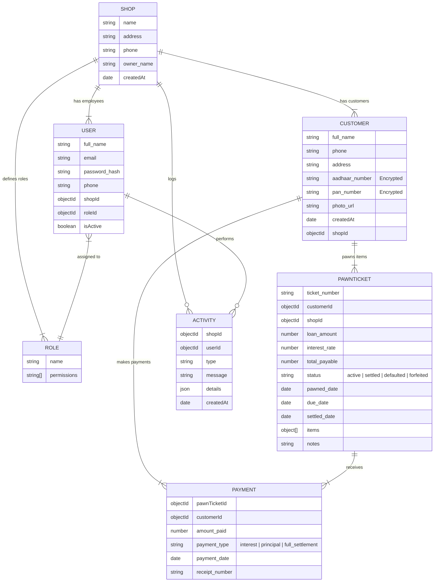
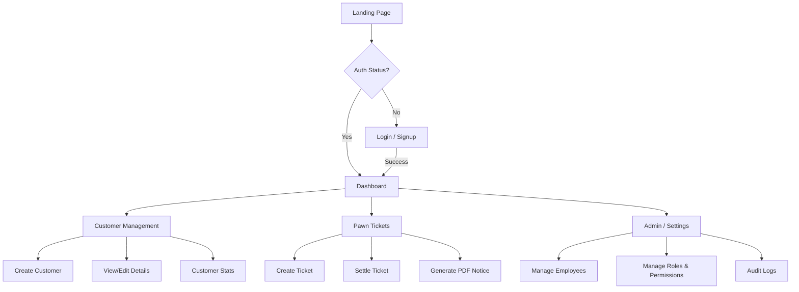

# 🏦 PawnManager (PawnSmart)

**PawnManager** is a modern, full-stack web application designed to streamline operations for pawn shops. It manages customers, pawn tickets, loans, interest calculations, and employee roles with a secure, responsive, and intuitive interface.


## 🚀 Live Demo

[Link](https://pawn-manager.vercel.app)  


---

## ✨ Key Features

- **Dashboard Analytics:** Real-time overview of active loans, monthly lending stats, top customers, and demographic charts (Area/Gender).
- **Customer Management:** Complete CRUD operations for customers with encrypted sensitive data (Aadhaar/PAN) and photo uploads.
- **Pawn Ticket System:** Create, update, and settle pawn tickets. Automatic calculation of advance amounts based on interest rates.
- **Role-Based Access Control (RBAC):** Granular permission system for **Owners** (full access) and **Workers** (restricted access).
- **Security:** AES-256-GCM encryption for sensitive personal identification numbers.
- **PDF Generation:** Auto-generate official pawn notices and loan documents.
- **Audit Logging:** Tracks all critical activities (creations, deletions, settlements) for security.
- **Dark Mode:** Fully responsive UI with toggleable Light/Dark themes.

---

## 🛠️ Technology Stack

### Frontend
- **Framework:** React (Vite)
- **Styling:** Tailwind CSS, Framer Motion (Animations)
- **State Management:** TanStack Query (React Query), Context API
- **UI Components:** Radix UI Primitives, Lucide & Tabler Icons, Shadcn-inspired components
- **Charts:** Recharts
- **Forms:** React Hook Form patterns

### Backend
- **Runtime:** Node.js
- **Framework:** Express.js
- **Database:** MongoDB (Mongoose ODM)
- **Authentication:** JWT (JSON Web Tokens)
- **Security:** Bcrypt (Hashing), Crypto (AES Encryption), Helmet/Cors
- **File Storage:** Cloudinary (via Multer)
- **PDF Generation:** PDF-Lib

---

## Database Design

The application uses a relational-style schema design within MongoDB to maintain data integrity between Shops, Users, Customers, and Tickets.





## 🛡️ Security Features
Data Encryption: Sensitive fields like Aadhaar and PAN numbers are encrypted using AES-256-GCM before storage and decrypted only upon retrieval.
Authentication: Stateless JWT-based authentication via Authorization: Bearer token (no cookies).
Authorization: Middleware ensures users can only access data belonging to their specific ShopID.
Permission Guard: Frontend routes and UI elements are protected by a PermissionGuard component that checks the user's role capabilities.


## project structure

```bash
Pawn_manager/
├── Backend/
│   ├── config/         # DB connection
│   ├── controllers/    # Route logic (Auth, Pawn, Customer, etc.)
│   ├── middlewares/    # Auth, Validation, Error Handling
│   ├── models/         # Mongoose Schemas
│   ├── routes/         # API Endpoints
│   ├── services/       # Encryption, Activity Logger
│   └── utils/          # Validators (Joi), API Response helpers
│
└── frontend/
    ├── src/
    │   ├── components/ # Reusable UI (Inputs, Charts, Modals)
    │   ├── contexts/   # Auth & Theme Context
    │   ├── hooks/      # Custom hooks (usePermission)
    │   ├── pages/      # Dashboard, Forms, Listings
    │   ├── services/   # Axios API configuration
    │   └── lib/        # Utilities (Tailwind merge)
```

## Installion & setup 

```
git clone https://github.com/yourname/Pawn_manager.git
cd Pawn_manager
```
## backend

```
cd Backend
npm install
npm run dev
```

# Env for backend
```
MONGO_URI=
JWT_SECRET=
CLOUDINARY_CLOUD_NAME=
CLOUDINARY_API_KEY=
CLOUDINARY_API_SECRET=
ENCRYPTION_KEY=
```

## frontend

```
cd frontend
npm install
npm run dev
```

